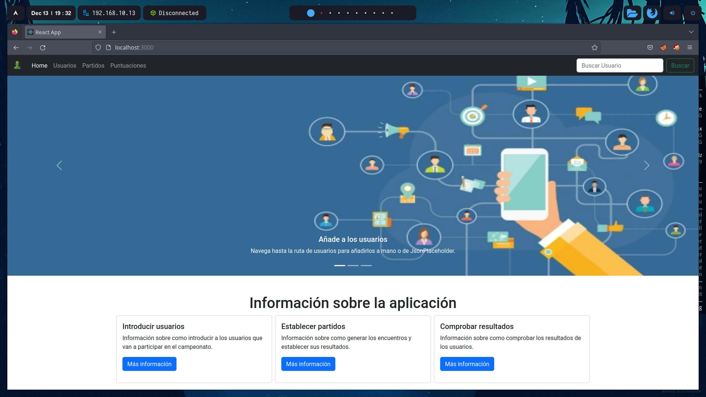
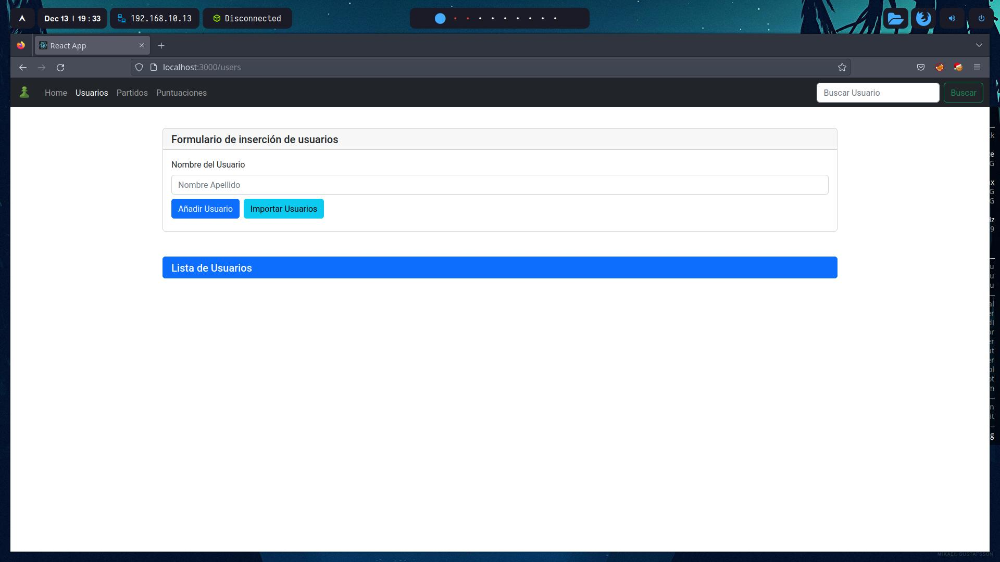
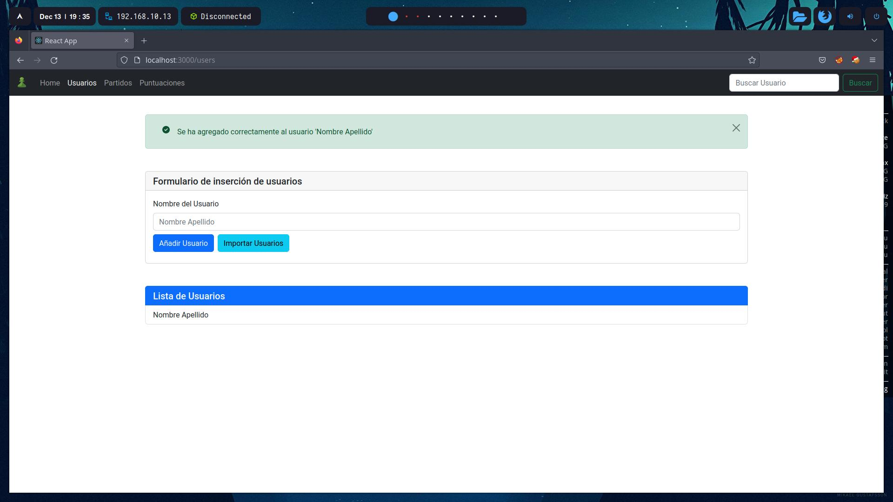
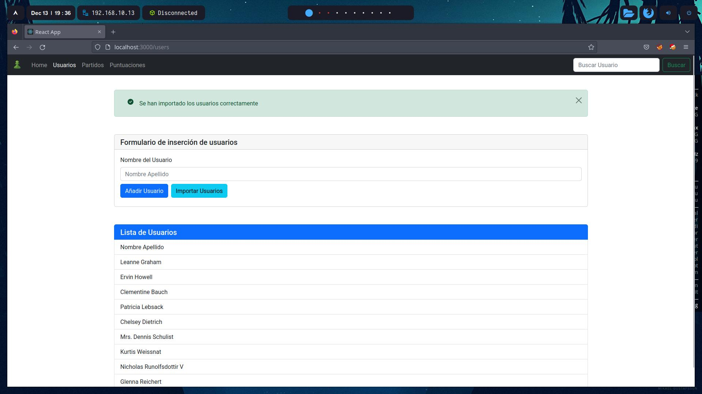
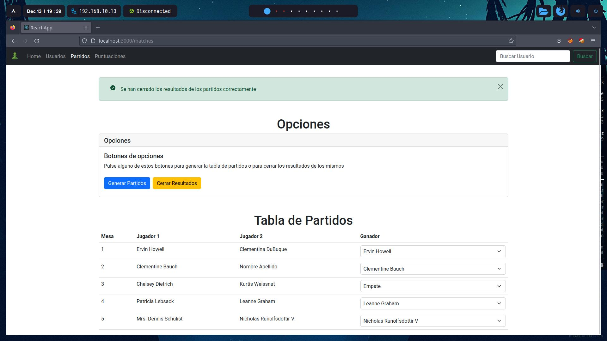
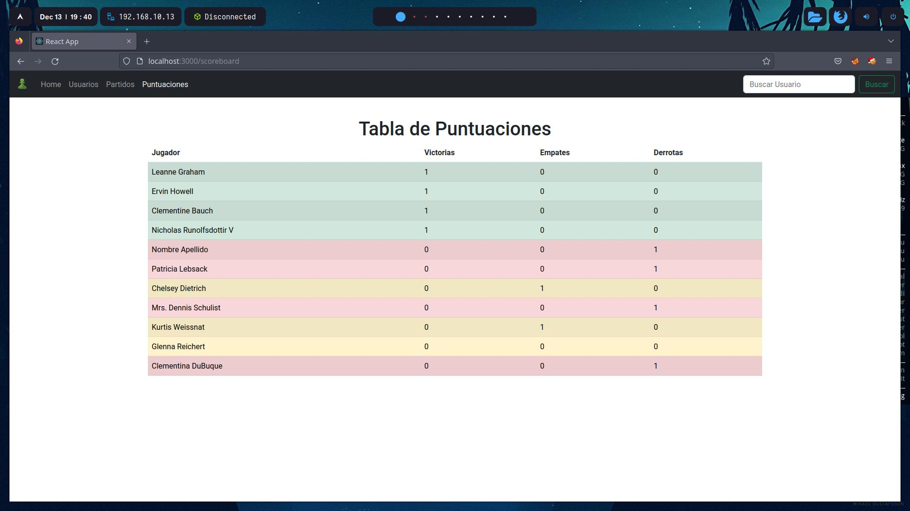
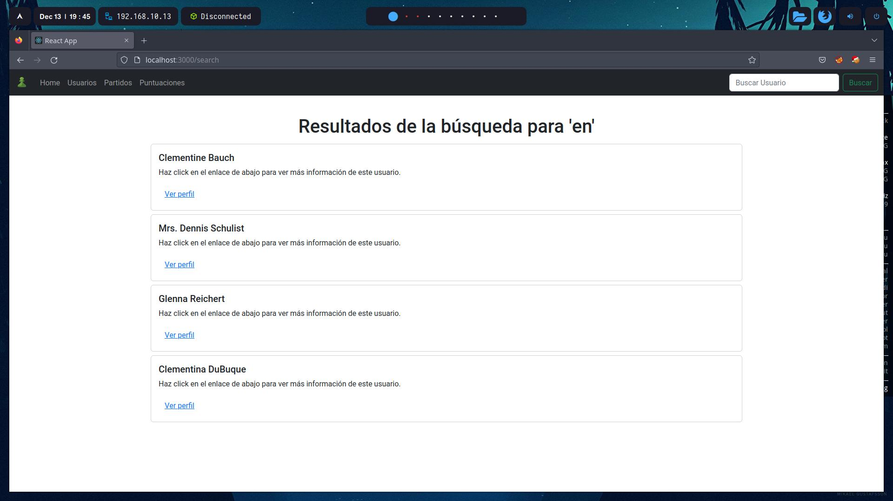
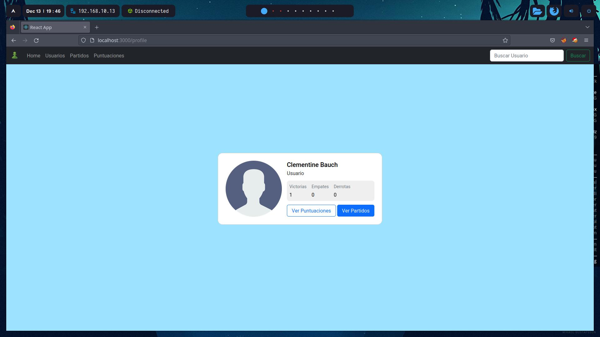

# Aplicación de Gestión de Partidos | Práctica de React y Bootstrap
Aplicación para gestionar partidos y sus resultados hecha en React y Bootstrap para una práctica de la asignatura Programación Web Cliente

## Índice
1) Información.
2) Imágenes.
3) Requisitos.
4) Instalación y Ejecución.
5) Créditos

### Información
Esta aplicación web se ha creado con React y Bootstrap para una práctica universitaria. Los objetivos de la práctica son los siguientes:
- La aplicación tiene que estar hecha con React y Bootstrap.
- La aplicación tiene que obtener datos de la API de JSON Placeholder (Users) mediante AXIOS.
- La aplicación tiene que mostrar la lista de participantes.
- La aplicación tiene que crear una tabla de partidos entre los diferentes usuarios.

Los objetivos han sido implementados y adicionalmente se le han agregado más funcionalidades a la aplicación. La lista de funcionalidades es la siguiente:
- Barra de navegación (Navbar) con marcado de la pestaña en la que se encuentra el usuario.
- Landing Page con información de uso de la aplicación.
- Carousel deslizable animado y con pasado automático con el tiempo con información sobre uso de la aplicación (En Landing Page).
- Tarjetas con información desplegable (Collapses) sobre uso de la aplicación (En Landing Page).
- Página de gestión de usuarios con posibilidad de insertar usuarios a mano e importarlos desde la API.
- Lista de usuarios registrados en la aplicación (En Gestión de Usuarios).
- Página de gestión de partidos con posiblidad de generar automáticamente los encuentros y establecer el ganador de los mismos.
- Botón para establecer los resultados de los partidos en las estadísticas de los usuarios (En Gestión de Partidos).
- Lista con los diferentes partidos, participantes y ganadores (En Gestión de Partidos).
- Sistema de mensajes de error e información en las páginas de Gestión de Usuarios y Gestión de Partidos.
- Página de puntuaciones para visibilizar en una tabla los resultados de los jugadores.
- Tabla con fondos de color en función del resultado de los jugadores:
    1) Verde: Más victorias que derrotas.
    2) Amarillo: Mismo número de victorias que de derrotas.
    3) Rojo: Más derrotas que victorias.
- Búsqueda de usuarios desde el Navbar.
- Visualización de perfiles de usuarios (Desde la búsqueda de los mismos).

### Imágenes
 
Landing Page:
 
<picture width="512" align="center">
 <source media="(prefers-color-scheme: dark)" srcset="./githubIMGs/homePageScreenshot.jpg">
 
</picture>

 
 
 
Gestión de Usuarios:
 
<picture width="512" align="center">
 <source media="(prefers-color-scheme: dark)" srcset="./githubIMGs/usersManagementScreenshot1.jpg">
 
</picture>

 
<picture width="512" align="center">
 <source media="(prefers-color-scheme: dark)" srcset="./githubIMGs/usersManagementScreenshot2.jpg">
 
</picture>

 
<picture width="512" align="center">
 <source media="(prefers-color-scheme: dark)" srcset="./githubIMGs/usersManagementScreenshot3.jpg">
 
</picture>

 
 
 
Gestión de Partidos:
 
<picture width="512" align="center">
 <source media="(prefers-color-scheme: dark)" srcset="./githubIMGs/matchesManagementScreenshot1.jpg">
 
</picture>

 
<picture width="512" align="center">
 <source media="(prefers-color-scheme: dark)" srcset="./githubIMGs/matchesManagementScreenshot2.jpg">
 
</picture>

 
 
 
Tabla de Puntuaciones:
 
<picture width="512" align="center">
 <source media="(prefers-color-scheme: dark)" srcset="./githubIMGs/scoreboard.jpg">
 
</picture>

 
 
 
Búsqueda de Usuarios:
 
<picture width="512" align="center">
 <source media="(prefers-color-scheme: dark)" srcset="./githubIMGs/search.jpg">
 
</picture>

 
 
 
Perfil de Usuarios:
 
<picture width="512" align="center">
 <source media="(prefers-color-scheme: dark)" srcset="./githubIMGs/profile.jpg">
 
</picture>

### Requisitos
- Tener <a href="https://nodejs.org/en/">NodeJS</a> instalado.
 
Versiones probadas:

| node.js | Probado             | Sistemas Operativos | Navegadores |
|:--------|:--------------------|:--------------------------------------------------|:-------------------------------------------------|
| 19.x    | :heavy_check_mark: | ArchLinnux (`x64`)     | Mozilla Firefox 107.0.1, Google Chrome 108.0.5359.98                                                 |
| <19.x    | :x:                |                                                   |                                                  |

- Tener <a href="https://www.npmjs.com/">npm</a> instalado.
 
Versiones probadas:

| npm | Probado             | Sistemas Operativos |
|-----|:--------------------|:--------------------------------------------------|
| 8.x    | :heavy_check_mark: | ArchLinnux (`x64`)     |
| <8.x    | :x:                |                                                   |

### Instalación y Ejecución
Pasos a seguir para instalar y ejecutar el servidor:
1) Clonar el repositorio con `git clone https://github.com/hecpabe/practicaReactBootstrap`
2) Instalar dependencias con `npm install`
3) Ejecutar la aplicación con `npm start`
4) Una vez que ya haya cargado el servidor se te abrirá en el navegador, si no, copia la dirección que te muestra en la consola, por defecto es `http://localhost:3000`

### Créditos
**Autor: *Héctor Paredes Benavides***
 
**Licencia: *Apache 2.0***
